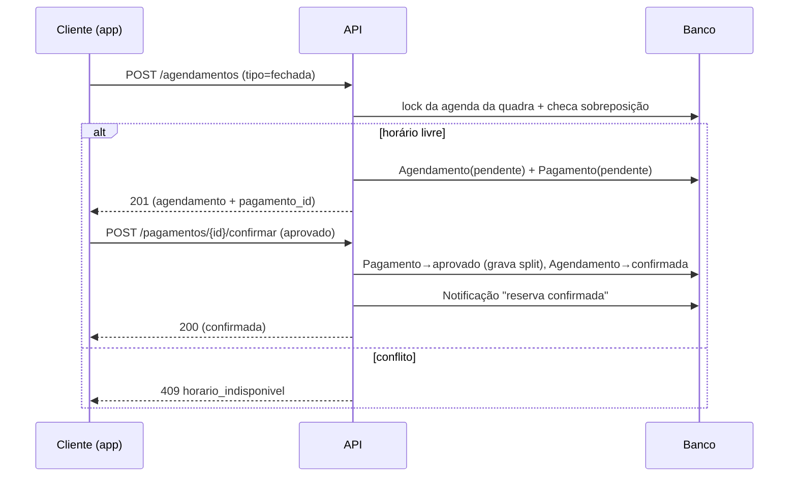
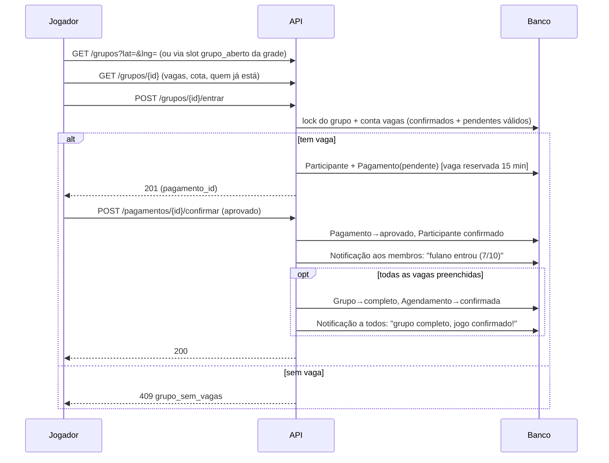

# Backend — API e Fluxos

Especificação da API REST (FastAPI) do MVP: rotas, contratos, regras de negócio por
endpoint e os fluxos de ponta a ponta. Base: [modelo-de-dominio.md](modelo-de-dominio.md).

> Convenções gerais da API estão na seção 1; as rotas na seção 2; os fluxos (com
> diagramas de sequência) na seção 3; regras transversais (concorrência, expiração,
> jobs) na seção 4.

---

## 1. Convenções da API

- **Prefixo**: todas as rotas sob `/api/v1`.
- **Formato**: JSON em tudo (fotos entram/saem como string base64, conforme o modelo).
- **Autenticação**: JWT Bearer (`Authorization: Bearer <token>`). Token emitido no
  login, carrega `sub` (id do usuário) e expiração. Não há refresh token no MVP —
  expiração longa (ex.: 24h) resolve para a demo.
- **Autorização**: dois níveis, resolvidos por dependencies do FastAPI:
  - `usuario_atual` — qualquer usuário logado;
  - `admin_do_estabelecimento` — usuário logado com vínculo `EstabelecimentoAdmin`
    para o estabelecimento do recurso acessado.
- **Datas/horas**: UTC, ISO 8601 (`2026-07-18`, `19:00`, `2026-07-18T19:00:00Z`).
- **Dinheiro**: inteiro em centavos, sempre (`valor_total: 12000` = R$ 120,00).
- **Paginação**: `?limit=` (default 20, máx 100) e `?offset=` nas listagens; resposta
  `{ "items": [...], "total": n }`.
- **Erros**: envelope único `{ "detail": { "codigo": "...", "mensagem": "..." } }`.
  Códigos de negócio estáveis (o front trata pelo `codigo`, não pela mensagem):

| HTTP | Código (exemplos) | Quando |
|---|---|---|
| 400 | `dados_invalidos` | Payload viola regra de negócio simples |
| 401 | `nao_autenticado` | Token ausente/expirado/inválido |
| 403 | `sem_permissao` | Logado, mas sem papel para a ação |
| 404 | `nao_encontrado` | Recurso inexistente |
| 409 | `horario_indisponivel` | Conflito de agenda (regra de exclusividade) |
| 409 | `grupo_sem_vagas` | Corrida por última vaga do grupo |
| 409 | `estado_invalido` | Transição de estado não permitida (ex.: pagar reserva cancelada) |
| 422 | — (padrão FastAPI) | Erro de validação de schema |

- **Erros de validação (422)** seguem o padrão do FastAPI/Pydantic.
- **Docs**: Swagger automático em `/docs` — é a "vitrine" da API na demo.

---

## 2. Rotas

### 2.1 Autenticação (`/auth`)

| Método | Rota | Auth | Descrição |
|---|---|---|---|
| POST | `/auth/registrar` | — | Cria usuário (nome, email, telefone, senha). Retorna usuário + token (já loga). |
| POST | `/auth/login` | — | Email + senha → `{ token, usuario }`. |
| GET | `/auth/me` | usuário | Usuário logado, incluindo lista de estabelecimentos que administra (o front decide se mostra o modo "painel"). |

**Regras**: email único (409 `email_ja_cadastrado`); senha com hash bcrypt; nunca
retornar `senha_hash`.

### 2.2 Usuário e perfil (`/usuarios/me`)

| Método | Rota | Auth | Descrição |
|---|---|---|---|
| PATCH | `/usuarios/me` | usuário | Atualiza perfil: nome, telefone, foto (base64), latitude/longitude, esportes_interesse, nivel_jogo. |
| GET | `/usuarios/me/agendamentos` | usuário | Meus agendamentos (como criador **ou** participante de grupo). Filtro `?escopo=proximos\|historico`. Cada item traz quadra, estabelecimento, grupo (se houver) e status — alimenta a tela "Meus agendamentos". |
| GET | `/usuarios/me/favoritos` | usuário | Quadras favoritas (expandidas, com dados da quadra + arena). IDs órfãos (quadra excluída) são ignorados na leitura. |
| POST | `/usuarios/me/favoritos/{quadra_id}` | usuário | Favorita (idempotente). |
| DELETE | `/usuarios/me/favoritos/{quadra_id}` | usuário | Desfavorita (idempotente). |

### 2.3 Esportes (`/esportes`)

| Método | Rota | Auth | Descrição |
|---|---|---|---|
| GET | `/esportes` | — | Lista as modalidades (tabela de referência, populada por seed). Alimenta filtros e formulários. |

Sem CRUD de esporte na API do MVP — seed no startup basta.

### 2.4 Estabelecimentos (`/estabelecimentos`)

| Método | Rota | Auth | Descrição |
|---|---|---|---|
| POST | `/estabelecimentos` | usuário | Cria arena; o criador vira `EstabelecimentoAdmin` com papel `dono`. Payload: dados cadastrais + comodidades + horário de funcionamento embutido. |
| GET | `/estabelecimentos` | — | **Busca da vitrine.** Filtros: `?lat=&lng=&raio_km=` (distância Haversine), `?esporte_id=`, `?comodidades=a,b`, `?q=` (nome). Retorna card: nome, foto de capa, distância, faixa de preço (menor `preco_base_hora` das quadras), nota média, esportes. Ordenação default por distância. |
| GET | `/estabelecimentos/{id}` | — | Detalhe completo: dados, fotos, comodidades, horário de funcionamento, quadras ativas, nota média + contagem de avaliações. |
| PATCH | `/estabelecimentos/{id}` | admin | Atualiza dados/status. |
| GET | `/estabelecimentos/{id}/avaliacoes` | — | Avaliações da arena (paginadas, mais recentes primeiro). |
| GET | `/estabelecimentos/{id}/agenda?data=` | admin | **Painel**: grade do dia com todas as quadras e seus agendamentos (qualquer status ativo), incluindo dados do cliente e do grupo. Uma chamada monta a tela inteira da agenda. |
| GET | `/estabelecimentos/{id}/relatorio?de=&ate=` | admin | Relatório simples do MVP: taxa de ocupação, receita confirmada (soma de `valor_total` de concluídas/confirmadas), horários de pico. |

**Regras**: busca só retorna `status = ativo`; nota média é agregada das avaliações
(cacheável depois, calculada por query no MVP).

### 2.5 Quadras (`/quadras` e aninhadas)

| Método | Rota | Auth | Descrição |
|---|---|---|---|
| POST | `/estabelecimentos/{id}/quadras` | admin | Cria quadra: nome, esportes (ids), capacidade, fotos, preco_base_hora. |
| GET | `/estabelecimentos/{id}/quadras` | — | Quadras da arena (público vê só `ativa`; admin vê todas). |
| GET | `/quadras/{id}` | — | Detalhe da quadra (com dados resumidos da arena). |
| PATCH | `/quadras/{id}` | admin | Atualiza dados/status. |
| GET | `/quadras/{id}/disponibilidade?data=` | — | **Grade de horários do dia** — ver abaixo. |

**Disponibilidade (calculada, não é tabela)** — resposta:

```json
{
  "quadra_id": "...", "data": "2026-07-18",
  "slots": [
    { "hora_inicio": "18:00", "hora_fim": "19:00", "status": "livre",
      "preco": 12000, "grupo": null },
    { "hora_inicio": "19:00", "hora_fim": "20:00", "status": "grupo_aberto",
      "preco": 12000,
      "grupo": { "id": "...", "vagas_totais": 10, "vagas_ocupadas": 6,
                  "valor_cota": 1200, "prazo_fechamento": "..." } },
    { "hora_inicio": "20:00", "hora_fim": "21:00", "status": "ocupado", "grupo": null }
  ]
}
```

Algoritmo: gera slots de 1h dentro do horário de funcionamento do estabelecimento
para o dia da semana; marca `ocupado` quando há agendamento ativo (`pendente` não
expirado, `confirmada`, `bloqueado`) sobrepondo; marca `grupo_aberto` quando o
agendamento sobreposto tem grupo com status `aberto` e visibilidade `publico` —
esse é o gancho do fluxo "entrar em grupo" direto da grade. Slots no passado saem
como `ocupado`.

### 2.6 Agendamentos (`/agendamentos`)

| Método | Rota | Auth | Descrição |
|---|---|---|---|
| POST | `/agendamentos` | usuário | **Cria reserva** (fechada ou com grupo). Ver payload abaixo. Valida exclusividade, cria `Agendamento (pendente)` + `Pagamento (pendente)` (+ `Grupo` e `Participante` do criador, se `tipo=grupo`). Retorna agendamento + pagamento a confirmar. |
| GET | `/agendamentos/{id}` | usuário | Detalhe (criador, participante do grupo, ou admin da arena). Inclui quadra, arena, grupo, pagamentos do solicitante. |
| POST | `/agendamentos/{id}/cancelar` | usuário/admin | Cancela conforme política (seção 4.3). Cliente cancela a própria reserva; admin cancela qualquer uma da arena (`motivo=cancelado_estabelecimento`). |
| POST | `/quadras/{id}/bloqueios` | admin | Cria `Agendamento` com `status=bloqueado` + `motivo` (`manutencao`, `evento`, ...). Mesma validação de exclusividade. |
| DELETE | `/agendamentos/{id}/bloqueio` | admin | Remove bloqueio (`bloqueado → cancelada`), liberando o horário. |
| POST | `/estabelecimentos/{id}/reservas-manuais` | admin | **Reserva manual** (cliente que ligou/chegou no balcão): quadra, data, horário, nome/telefone do cliente em campo livre, valor. Nasce direto `confirmada`, sem pagamento no app. Mantém a agenda única. |

**Payload do POST `/agendamentos`:**

```json
{
  "quadra_id": "...", "data": "2026-07-18",
  "hora_inicio": "19:00", "hora_fim": "20:00",
  "tipo": "grupo",
  "grupo": {
    "vagas_totais": 10, "vagas_minimas": 6,
    "visibilidade": "publico",
    "prazo_fechamento": "2026-07-18T15:00:00Z",
    "regra_vaga_sobrando": "criador_absorve"
  }
}
```

**Regras do POST**: `valor_total` = `preco_base_hora × duração` (não vem do cliente);
`vagas_totais ≤ capacidade` e `vagas_minimas ≤ vagas_totais`; `valor_cota =
valor_total ÷ vagas_totais` (arredonda para cima, em centavos); horário dentro do
funcionamento; data/hora no futuro; exclusividade sob lock (seção 4.1). No `tipo=grupo`,
o pagamento criado é a **cota do criador** (referência `participante`); no `fechada`,
é o valor total (referência `agendamento`).

### 2.7 Grupos abertos (`/grupos`)

| Método | Rota | Auth | Descrição |
|---|---|---|---|
| GET | `/grupos` | — | **"Jogos precisando de gente perto de você."** Filtros: `?lat=&lng=&raio_km=`, `?esporte_id=`, `?data=`. Retorna grupos `aberto` + `publico` com prazo futuro: esporte, arena, distância, data/horário, vagas restantes, valor da cota. Ordenação default por proximidade de horário. |
| GET | `/grupos/{id}` | — | Detalhe: agendamento (quadra/arena/horário), vagas, cota, prazo, regra, participantes confirmados (nome + foto). Funciona também para `visibilidade=por_link` — o id é o "link do convite". |
| POST | `/grupos/{id}/entrar` | usuário | Reserva vaga: cria `Participante` + `Pagamento (pendente)` da cota. Vaga só conta como ocupada com pagamento aprovado, mas a entrada pendente **reserva a vaga** por 15 min (seção 4.2). Erros: `grupo_sem_vagas`, `estado_invalido` (grupo não está `aberto`), `ja_participa`. |
| POST | `/grupos/{id}/sair` | usuário | Sai do grupo. Antes do prazo de cancelamento: estorna a cota. Depois: sem reembolso. Em ambos, `Participante.status=saiu` e a vaga reabre (grupo `completo` volta a `aberto`). Criador não sai — cancela o agendamento. |

Fechamento do grupo (completo / prazo / mínimo não atingido) não é rota: acontece na
confirmação de pagamento e no job de prazos (seções 3.4 e 4.4).

### 2.8 Pagamentos (`/pagamentos`) — simulado no MVP

| Método | Rota | Auth | Descrição |
|---|---|---|---|
| GET | `/pagamentos/{id}` | usuário (dono) | Status do pagamento. |
| POST | `/pagamentos/{id}/confirmar` | usuário (dono) | **Simula o webhook do gateway.** Body: `{ "resultado": "aprovado" \| "recusado", "meio": "pix" \| "cartao" }`. Dispara os efeitos em cadeia (seções 3.2 e 3.3). Idempotente: repetir sobre pagamento já resolvido retorna o estado atual (200) sem reprocessar. |

O split (`repasse_estabelecimento`, `comissao_plataforma`, `taxa_gateway`) é
calculado e gravado na aprovação com percentuais de configuração (ex.: comissão 10%,
gateway 2%) — demonstra o modelo de negócio sem gateway real. Trocar o simulador por
gateway de verdade = substituir o `PagamentoService` e transformar `/confirmar` em
webhook; o resto da API não muda.

### 2.9 Avaliações (`/avaliacoes`)

| Método | Rota | Auth | Descrição |
|---|---|---|---|
| POST | `/agendamentos/{id}/avaliacoes` | usuário | Avalia a arena (nota 1–5 + comentário). Só se o agendamento está `concluida` **e** o usuário jogou (criador ou participante confirmado). Uma avaliação por usuário por agendamento. |
| POST | `/avaliacoes/{id}/util` | usuário | Incrementa o contador `uteis` (MVP: sem controle de voto único — v2). |

Leitura fica em `GET /estabelecimentos/{id}/avaliacoes` (2.4).

### 2.10 Notificações (`/notificacoes`)

| Método | Rota | Auth | Descrição |
|---|---|---|---|
| GET | `/notificacoes` | usuário | Minhas notificações, mais recentes primeiro. `?apenas_nao_lidas=true`. O front consulta por polling — sem push/websocket no MVP. |
| POST | `/notificacoes/ler` | usuário | Marca como lidas: `{ "ids": [...] }` ou `{ "todas": true }`. |

Notificações são **criadas pelos services** nos eventos: reserva confirmada, alguém
entrou/saiu do grupo, grupo completo, jogo confirmado, risco de cancelamento, grupo
cancelado, lembrete de jogo. Cada uma carrega `referencia_tipo`/`referencia_id` para
deep link.

---

## 3. Fluxos de ponta a ponta

### 3.1 Busca e escolha de horário (cliente)

1. App carrega `GET /esportes` (filtros) e pede a localização.
2. `GET /estabelecimentos?lat=&lng=&raio_km=&esporte_id=` → vitrine de cards.
3. `GET /estabelecimentos/{id}` → página da arena (fotos, comodidades, quadras, nota).
4. `GET /quadras/{id}/disponibilidade?data=` → grade do dia. Cada slot já diz se está
   `livre` (reservar/criar grupo), `grupo_aberto` (entrar pagando a cota) ou `ocupado`.

Nenhuma dessas rotas exige login — logar só é necessário para reservar (reduz atrito).

### 3.2 Reserva fechada com pagamento



- O `pendente` **segura o horário por 15 minutos** (ninguém reserva por cima). Se o
  pagamento não chegar, expira: `cancelada` com `motivo=pagamento_expirado` e o slot
  volta a aparecer livre (seção 4.2).
- Pagamento `recusado` → agendamento `cancelada` imediatamente.

### 3.3 Criar grupo aberto e entrar em grupo

**Criar** — é o fluxo 3.2 com `tipo=grupo`: junto do agendamento nascem o `Grupo
(aberto)` e o `Participante` do criador; o pagamento pendente é a **cota do criador**
(o grupo só vale se o criador pagar — senão tudo expira junto).

**Entrar:**



**Sair** (`POST /grupos/{id}/sair`): antes do prazo de cancelamento → cota estornada;
depois → sem reembolso. Nos dois casos a vaga reabre (grupo `completo` regride para
`aberto`, mas agendamento já `confirmada` permanece) e os membros são notificados.

### 3.4 Fechamento do grupo pelo prazo (job)

A cada minuto, o job varre grupos `aberto`/`completo` com `prazo_fechamento` vencido:

| Situação no prazo | Efeito |
|---|---|
| Confirmados ≥ `vagas_minimas` | Grupo → `confirmado`; agendamento → `confirmada`; aplica `regra_vaga_sobrando`*; notifica "jogo confirmado". |
| Confirmados < `vagas_minimas` | Grupo → `cancelado`; agendamento → `cancelada` (`motivo=grupo_nao_formado`); **estorna todas as cotas**; horário volta a ficar livre; notifica todos. |

\* **Decisão de MVP**: com vagas sobrando, `criador_absorve` não exige ação (as cotas
pagas ficam como estão e a arena recebe o total do split das cotas pagas);
`recalcula_cota` é registrada e comunicada na notificação, mas o ajuste financeiro
(estorno parcial da diferença) fica para o v2 — pagamento é simulado, e estorno
parcial complicaria o modelo sem ganho de demo.

O job também notifica **risco de cancelamento** (grupo `aberto` abaixo do mínimo a
menos de N horas do prazo) e envia **lembrete de jogo** (agendamentos `confirmada`
próximos do horário), e marca `confirmada → concluida` quando o horário passa
(habilitando a avaliação).

### 3.5 Cancelamento e reembolso

- **Reserva fechada** (`POST /agendamentos/{id}/cancelar` pelo criador): até 24h antes
  do jogo → estorno integral; depois → cancela sem reembolso. Agendamento →
  `cancelada` (`motivo=cancelado_cliente`), horário liberado.
- **Pelo estabelecimento** (admin): estorno integral sempre, qualquer momento
  (`motivo=cancelado_estabelecimento`); se havia grupo, cancela o grupo e estorna
  todas as cotas; notifica todos.
- **Cancelar agendamento de grupo pelo criador**: só até o prazo de cancelamento;
  cancela grupo + estorna todas as cotas + notifica.

### 3.6 Painel do estabelecimento

1. Dono cria conta normal (`/auth/registrar`) e `POST /estabelecimentos` — vira admin.
2. Cadastra quadras (`POST /estabelecimentos/{id}/quadras`).
3. Dia a dia: `GET /estabelecimentos/{id}/agenda?data=` — grade única com reservas do
   app, reservas manuais e bloqueios, por quadra.
4. Bloqueia horários (`POST /quadras/{id}/bloqueios`) e registra reservas de balcão
   (`POST /estabelecimentos/{id}/reservas-manuais`) — agenda única, sem conflito.
5. Acompanha `GET /estabelecimentos/{id}/relatorio` (ocupação, receita, picos).

### 3.7 Pós-jogo

Agendamento vira `concluida` (job) → app oferece avaliação → `POST
/agendamentos/{id}/avaliacoes` → nota entra na média da arena, exibida na vitrine.

---

## 4. Regras transversais

### 4.1 Exclusividade de horário (sem duplo agendamento)

Toda criação de agendamento/bloqueio roda em transação com lock por quadra
(`SELECT ... FOR UPDATE` da quadra no Postgres; no SQLite a escrita já é serializada)
e revalida dentro da transação: não pode existir agendamento ativo (`pendente` não
expirado, `confirmada`, `bloqueado`) com interseção de intervalo no mesmo
`quadra_id` + `data`. Sobreposição: `hora_inicio < existente.hora_fim AND hora_fim >
existente.hora_inicio`. Falhou → 409 `horario_indisponivel`.

### 4.2 Expiração de pendentes (TTL 15 min)

`pendente` reserva recurso (horário ou vaga de grupo) por `TTL_PAGAMENTO = 15 min`
(config). Expirados são ignorados nas checagens de disponibilidade/vagas ("expiração
preguiçosa") e o job os marca `cancelada`/`saiu` + pagamento `recusado` de tempos em
tempos. Dupla proteção: mesmo com job atrasado, ninguém fica bloqueado por pendente
morto.

### 4.3 Política de cancelamento (config)

Constantes de configuração, não hardcode: `PRAZO_REEMBOLSO_HORAS = 24`,
`TTL_PAGAMENTO_MIN = 15`, `COMISSAO_PLATAFORMA_PCT = 10`, `TAXA_GATEWAY_PCT = 2`,
`ANTECEDENCIA_RISCO_HORAS = 6`, `ANTECEDENCIA_LEMBRETE_HORAS = 2`.

### 4.4 Job scheduler

Um loop assíncrono único (asyncio task no startup do FastAPI, intervalo de 60s) chama
`processar_pendencias()`: expira pendentes → processa prazos de grupo → conclui
agendamentos passados → dispara notificações de risco/lembrete. Cada passo é
idempotente (roda duas vezes sem efeito duplo). Sem Celery/Redis — desnecessário no
MVP e arriscado no prazo de hackathon.

### 4.5 O que fica de fora (alinhado ao ESCOPO)

Gateway real e split com repasse efetivo, chat do grupo, avaliação de jogadores,
matchmaking por nível, recorrência, lista de espera, push notification (polling
resolve), upload em storage externo (base64 no banco, por decisão do modelo).
