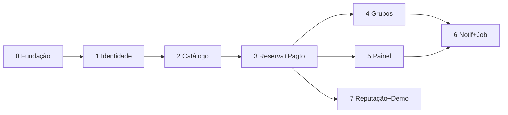

# Backend — Plano de Implementação (FastAPI)

Plano de construção do backend do MVP em FastAPI, organizado em camadas
(**models → services → controllers**) e em fases incrementais — cada fase termina com
a API funcionando e testável no Swagger. Contratos e regras de cada rota estão em
[backend-api-e-fluxos.md](backend-api-e-fluxos.md); entidades em
[modelo-de-dominio.md](modelo-de-dominio.md).

---

## 1. Stack e decisões técnicas

| Decisão | Escolha | Por quê |
|---|---|---|
| Framework | FastAPI + Uvicorn | Swagger automático (demo), validação Pydantic, async nativo |
| Python | 3.12 | |
| ORM | SQLAlchemy 2.0 (sessão **síncrona**) | Async não paga o custo no volume de hackathon; sync elimina toda uma classe de bugs |
| Banco | SQLite (arquivo) no MVP; connection string pronta para Postgres | Zero setup, roda em qualquer máquina da equipe; a camada de service isola o que mudaria |
| Migrações | `Base.metadata.create_all` + seed no startup | Alembic é overhead sem valor num schema que nasce agora; adotar se sobrar tempo |
| Schemas | Pydantic v2 (`schemas/` separado dos `models/`) | Contrato da API ≠ tabela; evita vazar `senha_hash` etc. |
| Auth | JWT (`pyjwt`) + hash `bcrypt` | Simples, sem estado, casa com dependencies |
| Jobs | Loop `asyncio` no lifespan do app (60s) | Sem Celery/Redis; ver seção 4.4 do doc de API |
| Gerenciador | `uv` (`pyproject.toml`) | Rápido e reprodutível |
| Testes | `pytest` + `TestClient` + SQLite em memória | Foco nos fluxos críticos (agendamento, grupo, pagamento) |
| CORS | Liberado para a origem do front (config) | MVP web/PWA |

**Fotos**: base64 direto no banco (decisão do modelo de domínio). Impor limite de
tamanho no schema (ex.: ~500KB por foto) para não degradar as listagens; listagens
retornam só a foto de capa, detalhe retorna a galeria.

**Dinheiro**: centavos (int) em todo lugar — schema, model, service. Nunca float.

## 2. Arquitetura em camadas

```
Request → Router (controller) → Service → Models/Session → Banco
              │                    │
           Schemas (Pydantic)   Regras de negócio + transação
```

- **Routers (controllers)** — `app/routers/`: declaram rota, auth (dependencies),
  schemas de entrada/saída e códigos de status. **Zero regra de negócio**: traduzem
  HTTP ⇄ chamadas de service. Erros de negócio viram HTTP aqui (exception handler
  global mapeia `ErroDeNegocio` → envelope `{codigo, mensagem}`).
- **Services** — `app/services/`: toda a regra de negócio e as transações. Recebem a
  `Session` + dados validados, devolvem entidades/DTOs. É onde vivem exclusividade de
  horário, máquina de estados, fechamento de grupo, split. Services chamam services
  (ex.: `AgendamentoService` usa `NotificacaoService`).
- **Models** — `app/models/`: SQLAlchemy declarativo, 1 arquivo por contexto do
  domínio. Enums Python espelhando os enums do modelo de domínio.
- **Schemas** — `app/schemas/`: Pydantic por contexto, sufixos `Create`, `Update`,
  `Out` (ex.: `AgendamentoCreate`, `AgendamentoOut`).
- **Core** — config (pydantic-settings lendo `.env`), segurança (JWT/hash),
  dependencies (`usuario_atual`, `admin_do_estabelecimento`), exceções de negócio.

### Estrutura de pastas

```
backend/
├── pyproject.toml
├── .env.example
├── app/
│   ├── main.py                  # create_app, CORS, routers, lifespan (seed + job)
│   ├── core/
│   │   ├── config.py            # Settings (.env): DB_URL, JWT_SECRET, constantes 4.3
│   │   ├── security.py          # hash/verify senha, criar/decodificar JWT
│   │   ├── deps.py              # get_db, usuario_atual, admin_do_estabelecimento
│   │   └── erros.py             # ErroDeNegocio(codigo, mensagem, http_status) + handler
│   ├── db/
│   │   ├── session.py           # engine, SessionLocal, Base
│   │   └── seed.py              # esportes + massa de demo (flag SEED_DEMO)
│   ├── models/
│   │   ├── usuario.py           # Usuario (+ favoritos/esportes_interesse como JSON)
│   │   ├── estabelecimento.py   # Estabelecimento, EstabelecimentoAdmin
│   │   ├── quadra.py            # Quadra, Esporte, quadra_esporte (N:N)
│   │   ├── agendamento.py       # Agendamento (+ campos de reserva manual)
│   │   ├── grupo.py             # Grupo, Participante
│   │   ├── pagamento.py         # Pagamento
│   │   ├── avaliacao.py         # Avaliacao
│   │   └── notificacao.py       # Notificacao
│   ├── schemas/                 # mesmo recorte dos models
│   ├── services/
│   │   ├── auth_service.py
│   │   ├── usuario_service.py
│   │   ├── estabelecimento_service.py   # inclui busca geográfica e relatório
│   │   ├── quadra_service.py
│   │   ├── disponibilidade_service.py   # grade de slots (função pura + query)
│   │   ├── agendamento_service.py       # criação, exclusividade, cancelar, bloqueio, manual
│   │   ├── grupo_service.py             # entrar/sair, fechamento, prazos
│   │   ├── pagamento_service.py         # simulador, split, estorno, efeitos em cadeia
│   │   ├── avaliacao_service.py
│   │   └── notificacao_service.py       # criar eventos, listar, marcar lidas
│   ├── routers/                 # auth, usuarios, esportes, estabelecimentos,
│   │                            # quadras, agendamentos, grupos, pagamentos,
│   │                            # avaliacoes, notificacoes
│   └── jobs/
│       └── pendencias.py        # processar_pendencias() + loop asyncio
└── tests/
    ├── conftest.py              # app + banco em memória + fixtures (usuário, arena…)
    ├── test_auth.py
    ├── test_disponibilidade.py
    ├── test_agendamentos.py     # exclusividade, expiração, cancelamento
    ├── test_grupos.py           # entrar/sair, completo, prazo, mínimo não atingido
    └── test_pagamentos.py       # aprovação em cadeia, estorno, idempotência
```

Notas de modelagem física:

- Listas embutidas do domínio (`esportes_interesse`, `quadras_favoritas`,
  `comodidades`, `horario_funcionamento`, `fotos`) → colunas **JSON**. Exceção:
  `Quadra ⇄ Esporte` vira tabela de junção real (a busca filtra por esporte via join).
- Reserva manual: campos opcionais no `Agendamento` (`cliente_nome`,
  `cliente_telefone`) — sem entidade nova, `criador_id` é o admin.
- Índices mínimos: `agendamento(quadra_id, data)`, `notificacao(usuario_id, lida)`,
  `pagamento(referencia_tipo, referencia_id)`, `email` único.

## 3. Fases de implementação

Ordem pensada para: (a) destravar o front cedo, (b) deixar o risco maior
(agendamento/grupo) com o máximo de tempo útil, (c) cada fase entregar algo
demonstrável. Estimativas em "blocos" de ~meio período de trabalho.

### Fase 0 — Fundação (1 bloco)

Esqueleto que tudo usa. **Sai daqui**: app rodando com `/docs`, banco criado, erro
padronizado.

1. `pyproject.toml` (fastapi, uvicorn, sqlalchemy, pydantic-settings, pyjwt, bcrypt,
   pytest, httpx) + `.env.example`.
2. `core/config.py` com todas as constantes da seção 4.3 do doc de API.
3. `db/session.py`, `core/erros.py` + exception handler, `main.py` com lifespan
   (create_all + seed de esportes), CORS.
4. `tests/conftest.py` com app de teste e banco em memória.

### Fase 1 — Identidade (1 bloco)

**Sai daqui**: registrar, logar, `GET /auth/me`, PATCH de perfil, dependencies de auth
prontas (as demais fases só as consomem).

1. Model + schemas de `Usuario`; `security.py` (bcrypt + JWT).
2. `auth_service` + router `/auth` (registrar, login, me).
3. `usuario_service` + `PATCH /usuarios/me`.
4. `deps.usuario_atual`; testes de auth (registro duplicado, senha errada, token
   inválido).

### Fase 2 — Catálogo (2 blocos)

**Sai daqui**: a vitrine inteira navegável — o front já monta Home, busca e página da
arena com dados reais.

1. Models: `Esporte` (+ seed), `Estabelecimento`, `EstabelecimentoAdmin`, `Quadra`.
2. `deps.admin_do_estabelecimento` (403 se não tem vínculo).
3. CRUD de estabelecimento e quadra (routers + services).
4. Busca geográfica: Haversine em Python sobre candidatos filtrados (região piloto =
   poucos registros; não usar PostGIS). Filtros esporte/comodidades/texto; card com
   menor preço e distância.
5. `GET /esportes`; testes de busca e permissão de admin.

### Fase 3 — Disponibilidade + Reserva fechada + Pagamento simulado (3 blocos) ⚠️ coração

**Sai daqui**: fluxo completo buscar → ver grade → reservar → pagar → confirmada.
É o mínimo demonstrável do produto; tudo depois é incremento.

1. `disponibilidade_service`: função pura `gerar_slots(horario_funcionamento,
   agendamentos_ativos, data, preco)` — testável sem banco — + rota
   `GET /quadras/{id}/disponibilidade`.
2. Model `Agendamento` + `agendamento_service.criar()` com transação + lock +
   validação de sobreposição (seção 4.1 do doc de API). Testar concorrência:
   duas reservas no mesmo slot → uma leva 409.
3. Model `Pagamento` + `pagamento_service`: confirmar (aprovado/recusado), cálculo do
   split, idempotência, efeitos em cadeia sobre o agendamento.
4. Expiração preguiçosa do `pendente` (TTL) dentro da checagem de disponibilidade.
5. `GET /agendamentos/{id}`, `GET /usuarios/me/agendamentos`,
   `POST /agendamentos/{id}/cancelar` com política de reembolso.
6. Testes: exclusividade, expiração, cancelamento antes/depois do prazo, pagamento
   recusado libera horário.

### Fase 4 — Grupos abertos (3 blocos) ⚠️ diferencial

**Sai daqui**: criar grupo, entrar/sair, fechamento por lotação e por prazo — o pitch
inteiro do produto funcionando.

1. Models `Grupo` e `Participante`; estender `agendamento_service.criar()` para
   `tipo=grupo` (grupo + participante do criador + pagamento da cota, tudo na mesma
   transação).
2. `grupo_service.entrar()`: lock do grupo, contagem de vagas (confirmados + pendentes
   válidos), participante + pagamento pendente. `sair()` com regra de reembolso e
   reabertura de vaga.
3. Efeitos no `pagamento_service`: cota aprovada → participante confirmado → checar
   lotação → grupo `completo` + agendamento `confirmada`.
4. Busca de grupos (`GET /grupos`, `GET /grupos/{id}`) e slot `grupo_aberto` na
   disponibilidade.
5. `grupo_service.processar_prazo()`: confirmação com mínimo OK / cancelamento com
   estorno de todos (função idempotente chamada pelo job).
6. Testes (a maior bateria do projeto): última vaga em corrida, completo, prazo com
   mínimo, prazo sem mínimo + estornos, sair antes/depois do prazo.

### Fase 5 — Painel do estabelecimento (1,5 bloco)

**Sai daqui**: o lado B do marketplace — agenda única, bloqueio, reserva manual,
relatório.

1. `GET /estabelecimentos/{id}/agenda?data=` (grade multi-quadra com cliente/grupo).
2. Bloqueios (`POST /quadras/{id}/bloqueios`, `DELETE .../bloqueio`) reusando a
   validação de exclusividade.
3. Reserva manual (`POST /estabelecimentos/{id}/reservas-manuais`) nascendo
   `confirmada`.
4. Relatório simples (ocupação, receita, picos) — queries agregadas.
5. Cancelamento pelo admin com estorno em cadeia (inclusive grupo).

### Fase 6 — Notificações + job (1,5 bloco)

**Sai daqui**: eventos aparecendo no app e as transições automáticas rodando sozinhas.

1. Model + `notificacao_service.criar(usuario, tipo, referencia)`; instrumentar os
   services das fases 3–5 nos eventos mapeados (seção 2.10 do doc de API).
2. Rotas `GET /notificacoes` e `POST /notificacoes/ler`.
3. `jobs/pendencias.py`: expira pendentes, processa prazos de grupo, conclui
   agendamentos passados, dispara risco/lembrete — loop no lifespan.
4. Teste do job: idempotência (rodar 2× não duplica efeito nem notificação).

### Fase 7 — Reputação, favoritos e acabamento (1,5 bloco)

**Sai daqui**: build de demo completo.

1. Avaliações: `POST /agendamentos/{id}/avaliacoes` (com as travas de elegibilidade),
   listagem na arena, nota média nos cards da busca, `POST /avaliacoes/{id}/util`.
2. Favoritos (`GET/POST/DELETE /usuarios/me/favoritos...`).
3. **Seed de demo** (`SEED_DEMO=true`): 3–4 arenas geolocalizadas na região piloto,
   quadras com fotos, agendamentos variados, 2 grupos abertos com vagas, avaliações —
   a demo não começa do zero.
4. Revisão final: varrer códigos de erro × doc de API, exemplos nos schemas
   (Swagger bonito), README do backend (subir com 2 comandos).

### Dependências entre fases



Com dois devs de backend: após a fase 3, um segue na 4 (grupos) e outro na 5
(painel); 6 e 7 fecham juntas. Total ≈ 14,5 blocos (~7 dias-pessoa) — para um
hackathon mais curto, a linha de corte segura é **fim da fase 4** (o pitch funciona;
painel vira "reserva manual não entra na demo" e notificações viram mock no front).

## 4. Diretrizes que valem para todas as fases

- **Transação por operação de service**: uma operação de negócio = uma transação
  (commit no service, nunca no router). Efeitos em cadeia (pagamento → agendamento →
  grupo → notificação) na mesma transação.
- **Máquinas de estado como funções de transição**: transições válidas explícitas por
  entidade (dict `de → {para}`); transição inválida → `ErroDeNegocio
  estado_invalido`. Evita estado impossível melhor que qualquer teste.
- **Idempotência** nos pontos reentrantes: confirmar pagamento já resolvido,
  processar prazo já processado, favoritar duas vezes — sempre 200 sem efeito duplo.
- **Config, não hardcode**: TTLs, prazos, percentuais — tudo em `Settings`.
- **Teste onde há risco**: exclusividade, grupos e pagamento têm bateria de testes;
  CRUDs simples ficam com o Swagger manual. Cobertura dirigida por risco, não por
  percentual.
- **Nada de gateway real**: o simulador (`pagamento_service`) é a única fronteira que
  tocaria o mundo externo — mantê-lo isolado é o que torna a troca futura barata.
