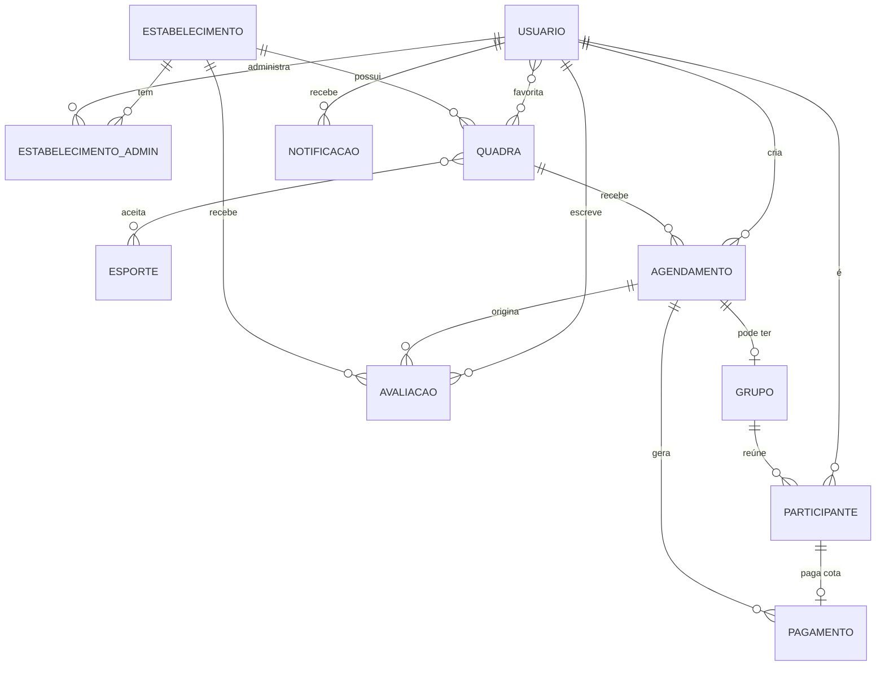
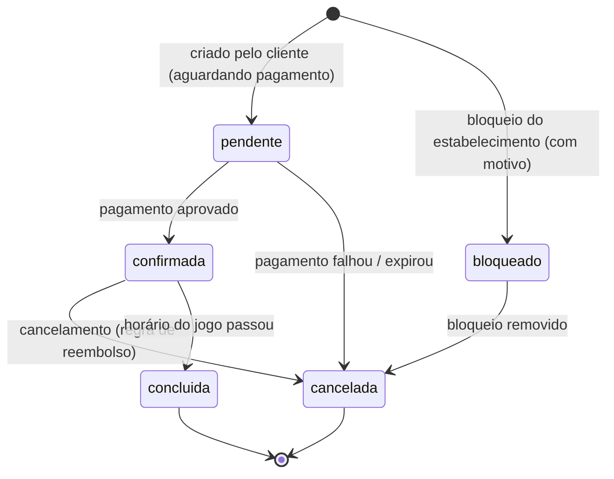
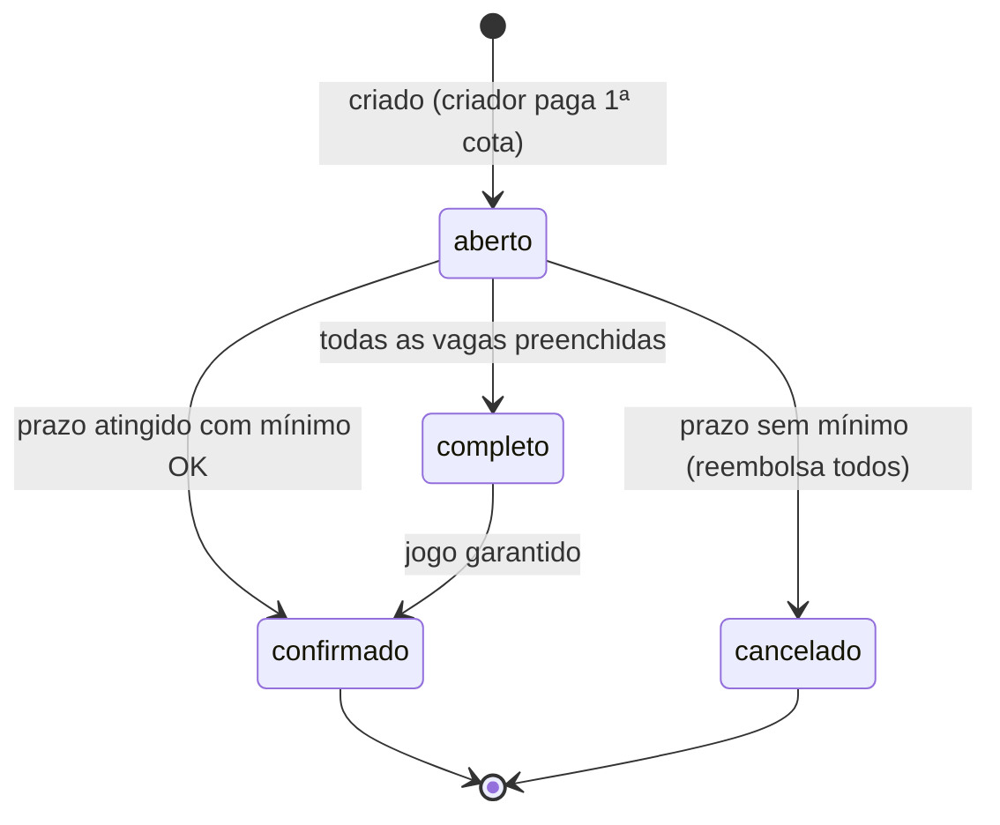
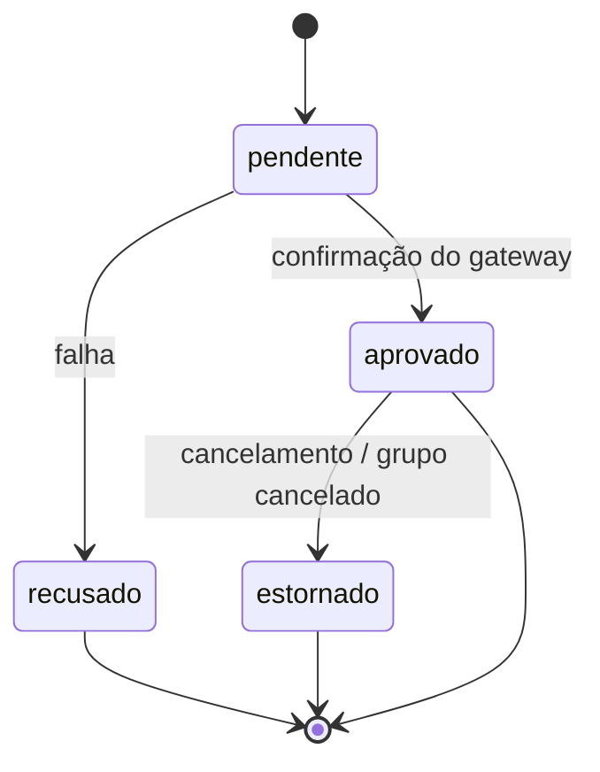

# Modelo de Domínio

Definição das estruturas (entidades) do produto, seus atributos, e **o que pertence a
quê**. Este é o modelo base para o schema do banco, a API e as telas.

## Diagrama de Entidades e Relacionamentos



## Convenções

- Todo registro tem `id` (identificador único), `criado_em` e `atualizado_em`.
- Valores monetários em centavos (inteiro) para evitar erro de ponto flutuante.
- Datas/horas em UTC; converter para fuso local na apresentação.
- **Fotos:** todas as imagens são armazenadas como **string base64 direto no banco**
  (não há URL/storage externo). Campos de foto guardam o base64 da imagem.
- `(v2)` marca campos/entidades desejáveis para depois do MVP.

---

## 1. Usuário

Pessoa que usa o app. Um mesmo usuário pode ser **jogador**, **administrador de
estabelecimento**, ou os dois — o papel é definido pelo vínculo, não por um tipo fixo.

| Campo | Tipo | Descrição |
|---|---|---|
| id | UUID | Identificador |
| nome | texto | Nome completo |
| email | texto (único) | Login |
| telefone | texto | Contato / notificações |
| senha_hash | texto | Credencial |
| foto | texto (base64) | Avatar (opcional) |
| latitude, longitude | decimal | Localização base para busca (opcional) |
| esportes_interesse | lista(Esporte) | Esportes favoritos / preferências do jogador |
| quadras_favoritas | lista(UUID → Quadra) | IDs das quadras marcadas como favoritas (aba "Favoritos") |
| nivel_jogo | enum | `iniciante` / `intermediario` / `avancado` (v2 para matchmaking) |
| criado_em, atualizado_em | timestamp | |

**Pertence a / relaciona-se com:** cria `Agendamentos`, é `Participante` de `Grupos`,
escreve `Avaliações`, recebe `Notificações`, pode administrar `Estabelecimentos`,
**favorita `Quadras`** (N:N — ver nota abaixo).

> **Favoritos (quadras):** `quadras_favoritas` guarda os IDs das quadras favoritas, no mesmo
> estilo embutido de `esportes_interesse`. É o suficiente para a aba "Favoritos" do perfil e
> para o coração das telas de busca/detalhe. Trade-offs a decidir:
> - **Lista embutida (adotado):** simples, casa com o resto do modelo (que embute listas). Porém
>   um `id` na lista **não tem integridade referencial** — se a quadra for excluída, sobra um ID
>   órfão que a leitura precisa ignorar.
> - **Tabela de junção `UsuarioQuadraFavorita (usuario_id, quadra_id, criado_em)` (v2):** troque
>   para esta forma se precisar de FK real, ordenar por data de favoritação, ou consultar "quem
>   favoritou / quadras mais favoritadas".
> - **Escopo (arena × quadra):** na UI o coração aparece no **card do estabelecimento** (arena),
>   não na quadra individual. Se a intenção for favoritar a arena inteira, use
>   `estabelecimentos_favoritos` no lugar (ou além) de `quadras_favoritas`.

---

## 2. Estabelecimento (Arena)

O local físico — a "arena". Guarda dados cadastrais, endereço, **comodidades** e o
**horário de funcionamento** (embutido, não é mais uma entidade separada). **Possui** uma
ou mais quadras.

| Campo | Tipo | Descrição |
|---|---|---|
| id | UUID | |
| nome | texto | Nome da arena |
| descricao | texto | Sobre o local |
| endereco | texto | Logradouro, número, bairro, cidade, CEP |
| latitude, longitude | decimal | Geolocalização (usada na busca por distância) |
| telefone | texto | Contato público |
| fotos | lista(texto base64) | Galeria do local |
| comodidades | lista(enum) | Estrutura disponível (ver valores abaixo) |
| horario_funcionamento | lista(objeto) | Um item por dia da semana (ver formato abaixo) |
| status | enum | `ativo` / `inativo` |
| criado_em, atualizado_em | timestamp | |

### Comodidades (valores de exemplo)

Lista de rótulos padronizados exibidos na página da arena e usados como filtro na busca:

`wifi`, `estacionamento`, `banheiro`, `vestiario`, `chuveiro`, `lanchonete`, `bar`,
`churrasqueira`, `area_coberta`, `iluminacao_noturna`, `acessibilidade`,
`aluguel_equipamento`, `bebedouro`, `ar_condicionado`.

### Horário de funcionamento (formato)

Embutido no estabelecimento como uma lista, um registro por dia:

```json
[
  { "dia_semana": "seg", "abertura": "08:00", "fechamento": "22:00", "fechado": false },
  { "dia_semana": "dom", "abertura": null,    "fechamento": null,    "fechado": true }
]
```

**Pertence a / relaciona-se com:** possui `Quadras`, é administrado por `Usuários` (via
vínculo), recebe `Avaliações`.

### 2.1 EstabelecimentoAdmin (vínculo)

Liga um `Usuário` a um `Estabelecimento` com um papel de gestão.

| Campo | Tipo | Descrição |
|---|---|---|
| usuario_id | UUID | Quem administra |
| estabelecimento_id | UUID | Qual arena |
| papel | enum | `dono` / `gestor` (v2: permissões finas) |

---

## 3. Quadra

A unidade agendável. **Pertence a um Estabelecimento.** É o que o cliente de fato reserva.

| Campo | Tipo | Descrição |
|---|---|---|
| id | UUID | |
| estabelecimento_id | UUID | Arena dona da quadra |
| nome | texto | Ex.: "Quadra 1 - Areia" |
| esportes | lista(Esporte) | Modalidades aceitas |
| capacidade | inteiro | Nº máx. de jogadores (limita vagas de grupo) |
| fotos | lista(texto base64) | Imagens da quadra |
| preco_base_hora | inteiro (centavos) | Preço de referência exibido na vitrine/busca |
| status | enum | `ativa` / `inativa` |
| criado_em, atualizado_em | timestamp | |

> **Sobre preço:** não há tabela de "regra de preço". O `preco_base_hora` é só o valor
> anunciado; o **valor efetivamente cobrado é definido direto no Agendamento** (`valor_total`),
> permitindo ajuste manual no momento da reserva.

**Pertence a / relaciona-se com:** de um `Estabelecimento`; recebe `Agendamentos`; aceita
um ou mais `Esportes`.

---

## 4. Esporte

Tabela de referência das modalidades (beach tênis, futebol, vôlei, padel, etc.).
Relação N:N com `Quadra` (uma quadra pode servir a vários esportes).

| Campo | Tipo | Descrição |
|---|---|---|
| id | UUID | |
| nome | texto | Ex.: "Beach Tênis" |
| icone | texto | Ícone para UI (opcional) |

---

## 5. Agendamento (Reserva)

Estrutura central. Representa uma quadra reservada em um intervalo de tempo, com
**exclusividade** (não pode haver dois agendamentos ativos na mesma quadra e horário).
Pode ser uma **reserva fechada** (uso privado), estar vinculado a um **grupo aberto**, ou
ser um **bloqueio** feito pelo estabelecimento (via status — não existe mais entidade
`Bloqueio` separada).

| Campo | Tipo | Descrição |
|---|---|---|
| id | UUID | |
| quadra_id | UUID | Quadra reservada |
| criador_id | UUID | Usuário que fez a reserva / criou o grupo / admin que bloqueou |
| data | data | Dia do jogo |
| hora_inicio, hora_fim | hora | Intervalo reservado |
| tipo | enum | `fechada` / `grupo` |
| status | enum | `pendente` / `confirmada` / `cancelada` / `concluida` / `bloqueado` |
| motivo | enum/texto | Motivo do bloqueio/cancelamento (ver padrões abaixo) |
| valor_total | inteiro (centavos) | **Preço definido aqui**, no ato da reserva |
| criado_em, atualizado_em | timestamp | |

### Status e motivos padrão

O antigo "Bloqueio" agora é apenas um Agendamento com `status = bloqueado`. O campo
`motivo` usa valores padronizados:

- Para **bloqueio**: `manutencao`, `reserva_particular`, `evento`, `interdicao`, `outro`.
- Para **cancelamento**: `cancelado_cliente`, `cancelado_estabelecimento`,
  `grupo_nao_formado`, `pagamento_expirado`.

**Regra de exclusividade:** ao confirmar ou bloquear, garantir que não exista outro
agendamento ativo (`pendente` / `confirmada` / `bloqueado`) sobrepondo o mesmo `quadra_id`
+ data + faixa de horário.

**Pertence a / relaciona-se com:** reserva uma `Quadra`; criado por um `Usuário`; pode
ter um `Grupo` (1:1 opcional); gera `Pagamento(s)`; ao concluir, origina `Avaliação`.

### Máquina de estados — Agendamento



---

## 6. Grupo (Grupo Aberto)

O diferencial do produto. **Vinculado a um Agendamento** (1:1). Divide o valor da quadra
em cotas e reúne jogadores avulsos até completar as vagas.

| Campo | Tipo | Descrição |
|---|---|---|
| id | UUID | |
| agendamento_id | UUID | Reserva base (define quadra/horário/valor) |
| vagas_totais | inteiro | Nº de cotas (≤ capacidade da quadra) |
| vagas_minimas | inteiro | Mínimo para o jogo acontecer |
| valor_cota | inteiro (centavos) | valor_total ÷ vagas (regra definida na criação) |
| visibilidade | enum | `publico` / `por_link` |
| prazo_fechamento | timestamp | Até quando aceita entradas / decide confirmação |
| regra_vaga_sobrando | enum | `recalcula_cota` / `criador_absorve` |
| status | enum | `aberto` / `completo` / `confirmado` / `cancelado` |
| criado_em, atualizado_em | timestamp | |

**Pertence a / relaciona-se com:** de um `Agendamento`; reúne `Participantes`.

### Regras de fechamento (resumo do [ESCOPO.md](../ESCOPO.md))

- **Completo:** todas as vagas preenchidas → grupo fecha, todos notificados.
- **Prazo atingido com mínimo OK:** jogo confirmado mesmo com vagas sobrando
  (aplica `regra_vaga_sobrando`).
- **Mínimo não atingido no prazo:** cancela automaticamente, reembolsa todos, horário
  volta a ficar disponível.

### Máquina de estados — Grupo



---

## 7. Participante (do Grupo)

Vínculo entre um `Usuário` e um `Grupo`. Cada participante ocupa uma vaga e paga uma cota.
A vaga só é garantida com pagamento.

| Campo | Tipo | Descrição |
|---|---|---|
| id | UUID | |
| grupo_id | UUID | Grupo que entrou |
| usuario_id | UUID | Jogador |
| pagamento_id | UUID | Cota paga |
| status | enum | `confirmado` / `saiu` |
| entrou_em | timestamp | |

---

## 8. Pagamento

Registra a movimentação financeira. **Pertence a um Agendamento** (reserva fechada) **ou
a um Participante** (cota de grupo). Guarda o split entre estabelecimento, plataforma e
gateway. No MVP pode ser **simulado**.

| Campo | Tipo | Descrição |
|---|---|---|
| id | UUID | |
| referencia_tipo | enum | `agendamento` / `participante` |
| referencia_id | UUID | Id do agendamento ou do participante |
| valor | inteiro (centavos) | Valor pago |
| meio | enum | `pix` / `cartao` |
| status | enum | `pendente` / `aprovado` / `recusado` / `estornado` |
| repasse_estabelecimento | inteiro | Parte do estabelecimento (split) |
| comissao_plataforma | inteiro | Take rate da plataforma |
| taxa_gateway | inteiro | Custo do gateway |
| reembolsado_em | timestamp | Se estornado |
| criado_em, atualizado_em | timestamp | |

### Máquina de estados — Pagamento



---

## 9. Avaliação

Feedback pós-jogo sobre o **estabelecimento (arena)**. **Origina-se de um Agendamento
concluído** — só quem jogou pode avaliar.

| Campo | Tipo | Descrição |
|---|---|---|
| id | UUID | |
| estabelecimento_id | UUID | Arena avaliada (alvo) |
| agendamento_id | UUID | Reserva concluída que habilitou a avaliação |
| pessoa | UUID → Usuário | Quem escreveu a avaliação |
| nota | inteiro | 1 a 5 |
| comentario | texto | Texto livre (opcional) |
| uteis | inteiro | Contador de votos "achei útil" |
| data | timestamp | Quando foi publicada |

> **Nota média** da arena é derivada (agregada) das avaliações — pode ser calculada ou
> cacheada, não precisa ser armazenada como campo fixo.
>
> **`uteis`** é um contador simples no MVP. No v2, uma tabela de votos
> (`avaliacao_id` + `usuario_id`) evita que a mesma pessoa vote mais de uma vez.
>
> **(v2)** avaliação de quadra específica e de jogadores (reputação/fair play).

---

## 10. Notificação

Eventos entregues a um `Usuário` (confirmação de reserva, grupo completo, risco de
cancelamento, lembrete de jogo).

| Campo | Tipo | Descrição |
|---|---|---|
| id | UUID | |
| usuario_id | UUID | Destinatário |
| tipo | enum | `reserva_confirmada` / `grupo_completo` / `grupo_risco` / `lembrete` / ... |
| titulo | texto | |
| corpo | texto | |
| referencia_tipo | enum | `agendamento` / `grupo` / ... |
| referencia_id | UUID | Objeto relacionado (deep link) |
| lida | booleano | |
| criado_em | timestamp | |

---

## Resumo dos relacionamentos ("o que pertence a quê")

| Estrutura | Pertence a | Contém / origina |
|---|---|---|
| Estabelecimento (Arena) | — (raiz da oferta) | Quadras, Admins, Avaliações; comodidades e horário embutidos |
| Quadra | Estabelecimento | Agendamentos |
| Agendamento | Quadra + Usuário criador | Grupo (opcional), Pagamentos, Avaliações; preço definido aqui |
| Grupo | Agendamento | Participantes |
| Participante | Grupo + Usuário | um Pagamento (cota) |
| Pagamento | Agendamento **ou** Participante | split (repasse/comissão/taxa) |
| Avaliação | Estabelecimento + Agendamento | escrita por um Usuário (`pessoa`) |
| Notificação | Usuário | referência a Agendamento/Grupo |

## Disponibilidade (calculada, não é tabela)

A grade de horários livres de uma quadra é derivada em tempo de consulta:

> **Horário de Funcionamento** (do estabelecimento) **−** Agendamentos ativos da quadra
> (status `pendente`, `confirmada` ou `bloqueado`) para aquela data.

## Pontos de extensão (v2+)

- **Avaliação de jogadores e de quadra específica** — hoje a avaliação é da arena.
- **Matchmaking por nível** — campo `nivel_jogo` (Usuário). (Removido de Grupo.)
- **Chat do grupo** — nova entidade `Mensagem` vinculada a `Grupo`.
- **Recorrência** ("todo sábado 10h") — regra que gera Agendamentos em série.
- **Lista de espera** — fila por horário para vagas last-minute.
- **Votos de utilidade** — tabela de votos para o contador `uteis` das avaliações.
